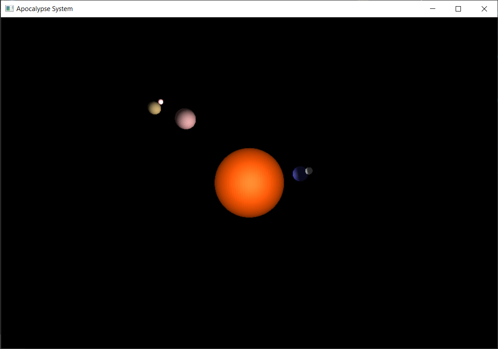

# A7

<div align='right'><font size=4><b>陈希尧</b> 3180103012</font>

[TOC]

## 功能说明

**控制**

* WSAD可以控制视角的前进后退左移右移
* '-'向下移动，'='向上移动（这里的上下是相对视角方向而不是相对坐标系）
* ↑↓←→方向键可以控制视角的上下左右旋转
* HJKL也可以控制视角的上下左右旋转（方向同vim）
* 鼠标点击后也可以拖移视角
* Q或ESC可以退出程序


**编译**

Windows下使用mingw-64的g++编译，glut库使用freeglut，跨平台时编译参数"-L"需修改为freeglut的lib所在位置

已在run.bat中配置完毕编译参数，双击即可编译&运行，同时压缩文件中包含静态链接的二进制文件，可直接执行

## 原理与实现

### 原理

光源唯一，材质根据不同星体进行改变

### 遇到的困难

1. NURBS的光照除了继续基础的设置，还要打开AUTO_NORMAL才能实现
2. 如果是本来只有单面光照的话，可以通过两种方法解决
    1. 对于NURBS曲面，可以调换控制点的顺序，让原本的内外平面交换而形状不变
    2. 如果一定要双面，需要同时修改LIGHT0和LIGHT1
    3. 注意：`glLightModeli(GL_LIGHT_MODEL_TWO_SIDE, GL_TRUE);`并不能起作用
3. 太阳的光照问题：由于点光源是在原点处，在太阳内部导致太阳不发光（已经开启双面了），我找出了一个非常巧妙的解决方法，如下：
    * 对于lighterObj这个类，在进行光源参数设定时分类进行讨论，==如果是太阳，就是用从相机这个方向发出的平行光==（具体操作是将position的xyzw分别设为相机的xyz，w=0表示平行光），如果不是太阳，就正常使用原点处的点光源

### 效果



### 心得

本次实验在编程上的难度主要在于光照的实现（虽然实验要求没有，但是强迫症看着只有形状没有表明的车子实在很难受），而车车本身的建模难度主要在于参数的选定，每次改参数都得编译一下看看结果，这麻烦的过程充分让我意识到了CAD工具在建模中的的重要性。

## Appendix

### Ref

[Lighting in OpenGL – HandsOn Sessions](http://www.csc.villanova.edu/~mdamian/Past/graphicssp13/notes/lightlab.pdf)

[Chapter 5 - OpenGL Programming Guide](https://www.glprogramming.com/red/chapter05.html)

[gluNurbsSurface](https://www.khronos.org/registry/OpenGL-Refpages/gl2.1/xhtml/gluNurbsSurface.xml)

[cse.csusb.edu/tongyu/courses/cs621/notes/color.php](http://cse.csusb.edu/tongyu/courses/cs621/notes/color.php)

[glLight](https://www.khronos.org/registry/OpenGL-Refpages/gl2.1/xhtml/glLight.xml)

### Src

#### SolarSys.h

```cpp
/**
 * @file SolarSys.h
 * @author Scott Chen
 * @em 3180103012@zju.edu.cn
 * @brief
 */
#ifndef SOLARSYS_H
#define SOLARSYS_H

#include <GL/gl.h>
#include <GL/glut.h>
#include <algorithm>
#include <cmath>
#include <iostream>
#include <tuple>
#include <vector>

const double PI  = 3.1425927;
const double D2R = PI / 180;

/* Global Parameter Def */
// #define USING_WIRE  // Comment to use glutSolidSphere

const int spehereLineRatio   = 100;   // Control wire number of sphere
const int fluentRatio        = 2;     // The higher the value, the more fulent the animation
const double cam_move_step   = 0.25;  // Move step of camera using WSAD
const double cam_rotate_step = 1;     // Rotate step of camera using HJKL, in unit of degree
const double PRP_VRP_Dist    = 10;    // Distance from PRP to VRP
const double fovy            = 68;    // View volumn: angle of view
const double zNear           = 0.01;  // View volume: distance to near clipping plane
const double zFar            = 100;   // View volume: distance to far clipping plane

const GLfloat light_ambient[]  = {.5, .5, 0, .1};
const GLfloat light_diffuse[]  = {.5, .5, .5, .5};
const GLfloat light_specular[] = {.2, 0, .5, .5};

const GLfloat mat_ambient_sun[]  = {.9, 0.3, 0.0, 0.9};
const GLfloat mat_diffuse_sun[]  = {.9, 0.3, 0.0, 0.9};
const GLfloat mat_specular_sun[] = {0.2, 0.2, 0.2, 0.2};
const GLfloat mat_shininess_sun  = 11.0;

const GLfloat mat_ambient_earth[]  = {.2, .2, .6, .4};
const GLfloat mat_diffuse_earth[]  = {.2, .2, .6, .6};
const GLfloat mat_specular_earth[] = {.1, .1, .1, .2};
const GLfloat mat_shininess_earth  = 5.0;

const GLfloat mat_ambient_moon[]  = {.8, .8, .8, .4};
const GLfloat mat_diffuse_moon[]  = {.8, .8, .8, .6};
const GLfloat mat_specular_moon[] = {.1, .1, .1, .2};
const GLfloat mat_shininess_moon  = 3.0;

const GLfloat mat_ambient_jupyter[]  = {.7, .5, .5, .4};
const GLfloat mat_diffuse_jupyter[]  = {.7, .5, .5, .4};
const GLfloat mat_specular_jupyter[] = {.1, .1, .1, .8};
const GLfloat mat_shininess_jupyter  = 3.0;

const GLfloat mat_ambient_europa[]  = {.6, .5, .3, .4};
const GLfloat mat_diffuse_europa[]  = {.6, .5, .3, .4};
const GLfloat mat_specular_europa[] = {.1, .1, .1, .2};
const GLfloat mat_shininess_europa  = 1.0;

const GLfloat mat_ambient_satellite[]  = {1, .5, .5, .4};
const GLfloat mat_diffuse_satellite[]  = {1, .5, .5, .4};
const GLfloat mat_specular_satellite[] = {.6, .6, .6, .2};
const GLfloat mat_shininess_satellite  = 1.0;

void gl_init(int argc, char **argv);
void display(void);
void reshape(int w, int h);
void keyboard(unsigned char key, GLint x, GLint y);
void keyboard_special(GLint key, GLint x, GLint y);
void mouseButton(int button, int state, int x, int y);
void mouseMove(int x, int y);
void idle();
void draw_cylinder(
    GLfloat radius, GLfloat height, GLubyte R = 255, GLubyte G = 255, GLubyte B = 255);

/**
 * @class an implenetation of camera with all its parameter and movement function
 */
class cameraObj {
  public:
    double eyex = 0, eyey = -PRP_VRP_Dist, eyez = 0;
    int mouse_oldx, mouse_oldy;

    double azimuthAngle      = 90,            // Counter-clock from x+
        polarAngle           = 90;            // Down from z+
    const double radicalDist = PRP_VRP_Dist;  // From origin

    void lookAt() {
        double ctx = eyex + radicalDist * sin(polarAngle * D2R) * cos(azimuthAngle * D2R),
               cty = eyey + radicalDist * sin(polarAngle * D2R) * sin(azimuthAngle * D2R),
               ctz = eyez + radicalDist * cos(polarAngle * D2R);
        double upx = -radicalDist * cos(polarAngle * D2R) * cos(azimuthAngle * D2R),
               upy = -radicalDist * cos(polarAngle * D2R) * sin(azimuthAngle * D2R),
               upz = radicalDist * sin(polarAngle * D2R);
        gluLookAt(eyex, eyey, eyez, ctx, cty, ctz, upx, upy, upz);
    }

    void reset() {
        glLoadIdentity();
        lookAt();
        glutPostRedisplay();
    }

    void moveForward(int flag = 1) {
        eyex += flag * cam_move_step * sin(polarAngle * D2R) * cos(azimuthAngle * D2R);
        eyey += flag * cam_move_step * sin(polarAngle * D2R) * sin(azimuthAngle * D2R);
        eyez += flag * cam_move_step * cos(polarAngle * D2R);
    }
    void moveLeft(int flag = 1) {
        eyex -= flag * cam_move_step * sin(azimuthAngle * D2R);
        eyey += flag * cam_move_step * cos(azimuthAngle * D2R);
    }
    void moveUp(int flag = 1) {
        eyex -= flag * cos(polarAngle * D2R) * cos(azimuthAngle * D2R);
        eyey -= flag * cos(polarAngle * D2R) * sin(azimuthAngle * D2R);
        eyez += flag * cam_move_step * sin(polarAngle * D2R);
    }
    void rotateLeft(double step = cam_rotate_step, int flag = 1) {
        azimuthAngle += flag * step;
    }
    void rotateUp(double step = cam_rotate_step, int flag = 1) { polarAngle -= flag * step; }

    void moveBackward() { moveForward(-1); }
    void moveRight() { moveLeft(-1); }
    void moveDown() { moveUp(-1); }
    void rotateRight(double step = cam_rotate_step) { rotateLeft(step, -1); }
    void rotateDown(double step = cam_rotate_step) { rotateUp(step, -1); }
};

/**
 * @class an implenetation of celestial object include sun, planet and satellite
 * and other smaller objects
 */
class celestialObj {
  private:
    // Const parameters
    float radius;
    float distance;  // distance from center
    float rotateV;
    float revolveV;
    float rotateTilt;
    float revolveTilt;
    std::tuple<int, int, int> colors;  // [0, 255]

    // State variables
    float rotateAngle  = 0;
    float revolveAngle = 0;

  public:
    // Functions
    celestialObj(float radius, float distance, float rotateV, float revolveV,
        float rotateTilt, float revolveTilt, int r, int g, int b)
        : radius(radius),
          distance(distance),
          rotateV(rotateV / fluentRatio),
          revolveV(revolveV / fluentRatio),
          rotateTilt(rotateTilt),
          revolveTilt(revolveTilt),
          colors(std::make_tuple(r, g, b)){};

    void trans(void) {
        using namespace std;
        glTranslatef(distance * cos(rotateTilt * D2R) * cos(rotateAngle * D2R),
            distance * cos(rotateTilt * D2R) * sin(rotateAngle * D2R),
            distance * sin(rotateTilt * D2R) * cos(rotateAngle * D2R));
        glRotatef(revolveAngle, -sin(revolveTilt * D2R), 0., cos(revolveTilt * D2R));
        glRotatef(revolveTilt, 0., -1., 0.);  // First rotate to tile angle
    }
    void draw() {
        using namespace std;
        trans();
        glColor3f(get<0>(colors) / 255., get<1>(colors) / 255., get<2>(colors) / 255.);
#ifdef USING_WIRE
        glutWireSphere(radius, spehereLineRatio, spehereLineRatio);
#else
        glutSolidSphere(radius, spehereLineRatio, spehereLineRatio);
#endif
    }

    void rotate() {
        rotateAngle += rotateV;
        rotateAngle = (rotateAngle > 360) ? rotateAngle - 360 : rotateAngle;
        revolveAngle += revolveV;
        revolveAngle = (revolveAngle > 360) ? revolveAngle - 360 : revolveAngle;
    }
};

extern cameraObj camera;
/**
 * @class lighter's implementation
 *
 */
class lighterObj {
  private:
    GLfloat pos[4] = {0, 0, 0, 1};
    int light_src;
    bool point_light;

  public:
    lighterObj(int light_src, GLfloat x, GLfloat y, GLfloat z, const GLfloat *light_ambient,
        const GLfloat *light_diffuse, const GLfloat *light_specular, bool point_light = 1)
        : light_src(light_src), point_light(point_light) {
        this->pos[0] = x;
        this->pos[1] = y;
        this->pos[2] = z;

        glLightModeli(GL_LIGHT_MODEL_TWO_SIDE, GL_TRUE);
        glLightfv(light_src, GL_POSITION, pos);
        glLightfv(light_src, GL_AMBIENT, light_ambient);
        glLightfv(light_src, GL_DIFFUSE, light_diffuse);
        glLightfv(light_src, GL_SPECULAR, light_specular);
    }
    void reset(const GLfloat *mat_ambient, const GLfloat *mat_diffuse,
        const GLfloat *mat_specular, const GLfloat mat_shininess) {
        static GLfloat eyepos[] = {0, 0, 0, 0};  // eyepos[3] = 0 to set parallel light
        if (point_light)
            glLightfv(light_src, GL_POSITION, pos);
        else {
            eyepos[0] = camera.eyex;
            eyepos[1] = camera.eyey;
            eyepos[2] = camera.eyez;
            glLightfv(light_src, GL_POSITION, eyepos);
        }
        glMaterialfv(GL_FRONT_AND_BACK, GL_AMBIENT, mat_ambient);
        glMaterialfv(GL_FRONT_AND_BACK, GL_SPECULAR, mat_specular);
        glMaterialfv(GL_FRONT_AND_BACK, GL_DIFFUSE, mat_diffuse);
        glMaterialf(GL_FRONT_AND_BACK, GL_SHININESS, mat_shininess);
    }

    void enable(void) {
        glEnable(GL_LIGHTING);
        glEnable(this->light_src);
        glEnable(GL_AUTO_NORMAL);
        glEnable(GL_NORMALIZE);
    }
    void disable() {
        glDisable(GL_LIGHTING);
        glDisable(this->light_src);
        glDisable(GL_AUTO_NORMAL);
        glDisable(GL_NORMALIZE);
    }
};

#endif
```

#### SolarSys.cpp

```cpp
/**
 * @file SolarSys.cpp
 * @author Scott Chen
 * @em 3180103012@zju.edu.cn
 * @brief This is an implementation to A4 of CG by prof. Hongzhi Wu
 *
 * @ref http://cse.csusb.edu/tongyu/courses/cs621/notes/color.php
 * @ref https://www.khronos.org/registry/OpenGL-Refpages/gl2.1/xhtml/glLight.xml
 */
#include "SolarSys.h"

cameraObj camera;
std::vector<celestialObj> starVec;

lighterObj lighter_point(GL_LIGHT0, 0, 0, 0, light_ambient, light_diffuse, light_specular);

lighterObj lighter_parallel(
    GL_LIGHT0, 0, 0, 0, light_ambient, light_diffuse, light_specular, 0);
// carObj car;

int main(int argc, char *argv[]) {
    // radius, distance, rotateV, revolveV, rotateTilt, revolveTilt, r, g, b
    starVec.emplace_back(2, 0, 0, 0.5, 0., 0., 255, 0, 0);        // sun
    starVec.emplace_back(0.4, 3, -3, -2, 10., 23.5, 0, 0, 255);   // earth
    starVec.emplace_back(0.18, 0.8, 9, 3, 0, 0., 255, 255, 255);  // moon
    starVec.emplace_back(0.8, 10, 2, 2, -45., 60., 0, 255, 0);    // jupyter
    starVec.emplace_back(0.5, 2.9, 3, 3, 80., 10., 255, 255, 0);  // europa
    starVec.emplace_back(0.2, 1, 5, 3, 20., 90., 255, 0, 255);    // satellite

    // car.initNurbs(2);

    gl_init(argc, argv);

    glHint(GL_PERSPECTIVE_CORRECTION_HINT, GL_NICEST);

    glutDisplayFunc(display);
    glutReshapeFunc(reshape);
    glutKeyboardFunc(keyboard);
    glutSpecialFunc(keyboard_special);
    glutMouseFunc(mouseButton);
    glutMotionFunc(mouseMove);
    glutIdleFunc(idle);

    glutMainLoop();
    return 0;
}

void gl_init(int argc, char **argv) {
    glutInit(&argc, argv);
    glutInitDisplayMode(GLUT_DOUBLE | GLUT_RGB | GLUT_DEPTH);
    glutInitWindowSize(900, 600);
    glutCreateWindow("Apocalypse System");
    glClearColor(0., 0., 0., 0.);
    glShadeModel(GL_FLAT);

    glEnable(GL_DEPTH_TEST);
    glDepthFunc(GL_LESS);
}

void display() {
    glClear(GL_COLOR_BUFFER_BIT | GL_DEPTH_BUFFER_BIT);

    // Sun
    glPushMatrix();
    lighter_parallel.reset(
        mat_ambient_sun, mat_diffuse_sun, mat_specular_sun, mat_shininess_sun);
    lighter_parallel.enable();
    starVec[0].draw();
    lighter_parallel.disable();
    glPopMatrix();

    // Earth & Moon
    lighter_point.reset(
        mat_ambient_earth, mat_diffuse_earth, mat_specular_earth, mat_shininess_earth);
    lighter_point.enable();
    glPushMatrix();
    starVec[1].draw();
    glPopMatrix();
    lighter_point.disable();

    lighter_point.reset(
        mat_ambient_moon, mat_diffuse_moon, mat_specular_moon, mat_shininess_moon);
    lighter_point.enable();
    glPushMatrix();
    starVec[1].draw();
    starVec[2].draw();
    glPopMatrix();
    lighter_point.disable();

    // Jupyter
    lighter_point.reset(mat_ambient_jupyter, mat_diffuse_jupyter, mat_specular_jupyter,
        mat_shininess_jupyter);
    lighter_point.enable();
    glPushMatrix();
    starVec[3].draw();
    glPopMatrix();
    lighter_point.disable();

    // Europa
    lighter_point.reset(
        mat_ambient_europa, mat_diffuse_europa, mat_specular_europa, mat_shininess_europa);
    lighter_point.enable();
    glPushMatrix();
    starVec[3].draw();
    starVec[4].draw();
    glPopMatrix();
    lighter_point.disable();

    // Satellite
    lighter_point.reset(mat_ambient_satellite, mat_diffuse_satellite, mat_specular_satellite,
        mat_shininess_satellite);
    lighter_point.enable();
    glPushMatrix();
    starVec[3].draw();
    starVec[4].draw();
    starVec[5].draw();
    lighter_point.disable();
    glPopMatrix();

    // glPushMatrix();
    // car.trans();
    // glScalef(0.5, 0.5, 0.5);
    // glTranslatef(-4.5, -1.5, 0);
    // car.draw();
    // glPopMatrix();

    // glFlush();

    glutSwapBuffers();
}

void reshape(int w, int h) {
    glViewport(0, 0, w, h);
    glMatrixMode(GL_PROJECTION);
    glLoadIdentity();

    gluPerspective(fovy, (double)w / (double)h, zNear, zFar);
    glMatrixMode(GL_MODELVIEW);
    glLoadIdentity();
    camera.lookAt();
}

void keyboard(unsigned char key, GLint x, GLint y) {
    bool changed = 1;
    switch (key) {
        case 'w': camera.moveForward(); break;
        case 's': camera.moveBackward(); break;
        case 'a': camera.moveLeft(); break;
        case 'd': camera.moveRight(); break;

        case 'h': camera.rotateLeft(); break;
        case 'j': camera.rotateDown(); break;
        case 'k': camera.rotateUp(); break;
        case 'l': camera.rotateRight(); break;

        case '=': camera.moveUp(); break;
        case '-': camera.moveDown(); break;

        case 'q': exit(0); break;
        case 27: exit(0); break;

        default: changed = 0; break;
    }
    if (changed)
        camera.reset();
}

void keyboard_special(GLint key, GLint x, GLint y) {
    bool changed = 1;
    switch (key) {
        case GLUT_KEY_UP: camera.rotateUp(); break;
        case GLUT_KEY_DOWN: camera.rotateDown(); break;
        case GLUT_KEY_LEFT: camera.rotateLeft(); break;
        case GLUT_KEY_RIGHT: camera.rotateRight(); break;
        default: changed = 0; break;
    }
    if (changed)
        camera.reset();
}

void mouseButton(int button, int state, int x, int y) {
    if (button == GLUT_LEFT_BUTTON && state == GLUT_DOWN) {
        camera.mouse_oldx = x;
        camera.mouse_oldy = y;
    }
}

void mouseMove(int x, int y) {
    camera.rotateLeft((x - camera.mouse_oldx) / 5);
    camera.rotateUp((y - camera.mouse_oldy) / 5);
    camera.mouse_oldx = x;
    camera.mouse_oldy = y;
    camera.reset();
}

void idle() {
    for (auto &i : starVec)
        i.rotate();
    // car.rotate();
    glutPostRedisplay();
    Sleep(30 / fluentRatio);
}
```

