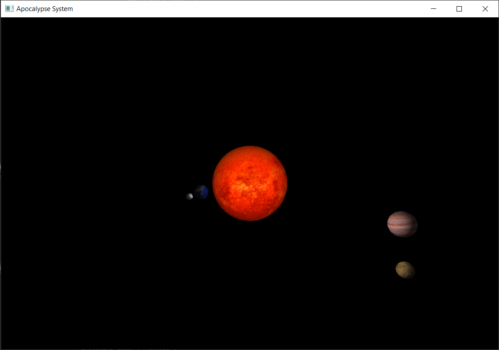
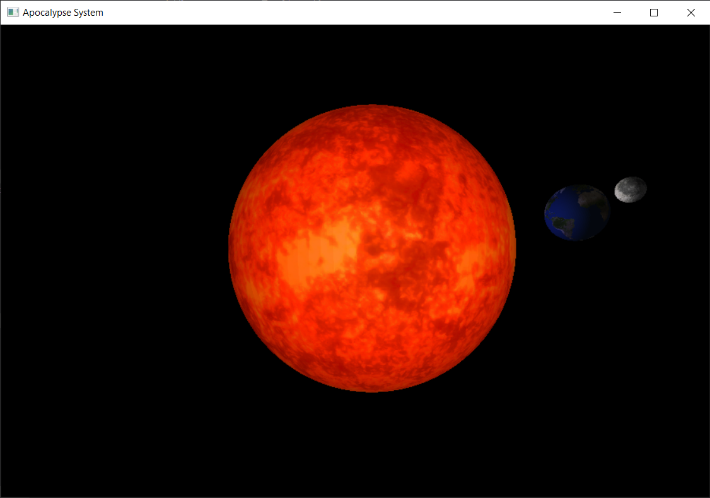
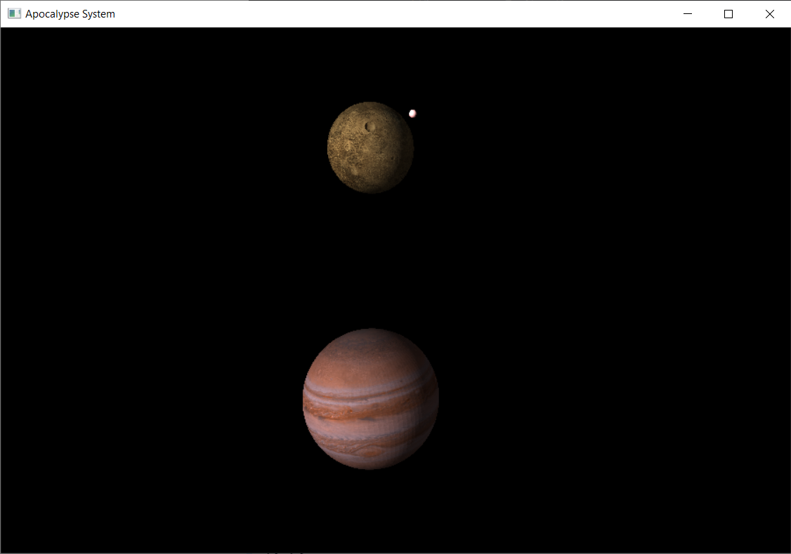

# A9

<div align='right'><font size=4><b>陈希尧</b> 3180103012</font>

[TOC]

## 功能说明

**控制**

* WSAD可以控制视角的前进后退左移右移
* '-'向下移动，'='向上移动（这里的上下是相对视角方向而不是相对坐标系）
* ↑↓←→方向键可以控制视角的上下左右旋转
* HJKL也可以控制视角的上下左右旋转（方向同vim）
* 鼠标点击后也可以拖移视角
* Q或ESC可以退出程序


**贴图**

texture文件夹中提供了2k和1k两种分辨率的贴图，由于我的破笔记本集显性能有限，使用的是1k的贴图，测验时可以在main函数前面几行对星体初始化的时候把贴图路径中的1k_xxx改成2k_xxx，体验超高分辨率带来的极致快感。


**编译**

Windows下使用mingw-64的g++编译，glut库使用freeglut，跨平台时编译参数"-L"需修改为freeglut的lib所在位置

已在run.bat中配置完毕编译参数，双击即可编译&运行，同时压缩文件中包含静态链接的二进制文件，可直接执行

## 实验结果

(请忽略大小比例和公转角度的问题

**总体**



**日、地、月**



**木、木卫二、人造卫星**



## 总结

### 遇到的困难

3. 一开始用了面向对象的贴图方案，直接在构造函数里面初始化了贴图，然而一直不行，后来发现顺序不对，得gl init完了init才行，因此改了改贴图初始化的位置

## Appendix

### Ref

纹理素材来源：https://www.solarsystemscope.com/textures/

### Src

#### SolarSys.h

```cpp
/**
 * @file SolarSys.h
 * @author Scott Chen
 * @em 3180103012@zju.edu.cn
 * @brief
 */
#ifndef SOLARSYS_H
#define SOLARSYS_H

#include <GL/gl.h>
#include <GL/glut.h>
#include <algorithm>
#include <cmath>
#include <iostream>
#include <tuple>
#include <vector>

const double PI  = 3.1425927;
const double D2R = PI / 180;

#define BITMAP_ID 0x4D42

/* Global Parameter Def */
// #define USING_WIRE  // Comment to use glutSolidSphere

const int spehereLineRatio   = 100;   // Control wire number of sphere
const int fluentRatio        = 2;     // The higher the value, the more fulent the animation
const double cam_move_step   = 0.25;  // Move step of camera using WSAD
const double cam_rotate_step = 1;     // Rotate step of camera using HJKL, in unit of degree
const double PRP_VRP_Dist    = 10;    // Distance from PRP to VRP
const double fovy            = 68;    // View volumn: angle of view
const double zNear           = 0.01;  // View volume: distance to near clipping plane
const double zFar            = 100;   // View volume: distance to far clipping plane

const GLfloat light_ambient[]  = {.5, .5, 0, .1};
const GLfloat light_diffuse[]  = {.5, .5, .5, .5};
const GLfloat light_specular[] = {.2, 0, .5, .5};

const GLfloat mat_ambient_sun[]  = {.9, 0.3, 0.0, 0.9};
const GLfloat mat_diffuse_sun[]  = {.9, 0.3, 0.0, 0.9};
const GLfloat mat_specular_sun[] = {0.2, 0.2, 0.2, 0.2};
const GLfloat mat_shininess_sun  = 11.0;

const GLfloat mat_ambient_earth[]  = {.6, .6, .6, .9};
const GLfloat mat_diffuse_earth[]  = {.2, .2, .6, .6};
const GLfloat mat_specular_earth[] = {.3, .3, .3, .2};
const GLfloat mat_shininess_earth  = 5.0;

const GLfloat mat_ambient_moon[]  = {.8, .8, .8, .4};
const GLfloat mat_diffuse_moon[]  = {.8, .8, .8, .6};
const GLfloat mat_specular_moon[] = {.1, .1, .1, .2};
const GLfloat mat_shininess_moon  = 3.0;

const GLfloat mat_ambient_jupiter[]  = {.7, .5, .5, .4};
const GLfloat mat_diffuse_jupiter[]  = {.7, .5, .5, .4};
const GLfloat mat_specular_jupiter[] = {.1, .1, .1, .8};
const GLfloat mat_shininess_jupiter  = 3.0;

const GLfloat mat_ambient_europa[]  = {.6, .5, .3, .4};
const GLfloat mat_diffuse_europa[]  = {.6, .5, .3, .4};
const GLfloat mat_specular_europa[] = {.1, .1, .1, .2};
const GLfloat mat_shininess_europa  = 1.0;

const GLfloat mat_ambient_satellite[]  = {1, .5, .5, .4};
const GLfloat mat_diffuse_satellite[]  = {1, .5, .5, .4};
const GLfloat mat_specular_satellite[] = {.6, .6, .6, .2};
const GLfloat mat_shininess_satellite  = 1.0;

void gl_init(int argc, char **argv);
void display(void);
void reshape(int w, int h);
void keyboard(unsigned char key, GLint x, GLint y);
void keyboard_special(GLint key, GLint x, GLint y);
void mouseButton(int button, int state, int x, int y);
void mouseMove(int x, int y);
void idle();
void draw_cylinder(
    GLfloat radius, GLfloat height, GLubyte R = 255, GLubyte G = 255, GLubyte B = 255);

/**
 * @class an implenetation of camera with all its parameter and movement function
 */
class cameraObj {
  public:
    double eyex = 0, eyey = -PRP_VRP_Dist, eyez = 0;
    int mouse_oldx, mouse_oldy;

    double azimuthAngle      = 90,            // Counter-clock from x+
        polarAngle           = 90;            // Down from z+
    const double radicalDist = PRP_VRP_Dist;  // From origin

    void lookAt() {
        double ctx = eyex + radicalDist * sin(polarAngle * D2R) * cos(azimuthAngle * D2R),
               cty = eyey + radicalDist * sin(polarAngle * D2R) * sin(azimuthAngle * D2R),
               ctz = eyez + radicalDist * cos(polarAngle * D2R);
        double upx = -radicalDist * cos(polarAngle * D2R) * cos(azimuthAngle * D2R),
               upy = -radicalDist * cos(polarAngle * D2R) * sin(azimuthAngle * D2R),
               upz = radicalDist * sin(polarAngle * D2R);
        gluLookAt(eyex, eyey, eyez, ctx, cty, ctz, upx, upy, upz);
    }

    void reset() {
        glLoadIdentity();
        lookAt();
        glutPostRedisplay();
    }

    void moveForward(int flag = 1) {
        eyex += flag * cam_move_step * sin(polarAngle * D2R) * cos(azimuthAngle * D2R);
        eyey += flag * cam_move_step * sin(polarAngle * D2R) * sin(azimuthAngle * D2R);
        eyez += flag * cam_move_step * cos(polarAngle * D2R);
    }
    void moveLeft(int flag = 1) {
        eyex -= flag * cam_move_step * sin(azimuthAngle * D2R);
        eyey += flag * cam_move_step * cos(azimuthAngle * D2R);
    }
    void moveUp(int flag = 1) {
        eyex -= flag * cos(polarAngle * D2R) * cos(azimuthAngle * D2R);
        eyey -= flag * cos(polarAngle * D2R) * sin(azimuthAngle * D2R);
        eyez += flag * cam_move_step * sin(polarAngle * D2R);
    }
    void rotateLeft(double step = cam_rotate_step, int flag = 1) {
        azimuthAngle += flag * step;
    }
    void rotateUp(double step = cam_rotate_step, int flag = 1) { polarAngle -= flag * step; }

    void moveBackward() { moveForward(-1); }
    void moveRight() { moveLeft(-1); }
    void moveDown() { moveUp(-1); }
    void rotateRight(double step = cam_rotate_step) { rotateLeft(step, -1); }
    void rotateDown(double step = cam_rotate_step) { rotateUp(step, -1); }
};

extern int celestial_num;
extern unsigned char *LoadBitmapFile(char *filename, BITMAPINFOHEADER *bitmapInfoHeader);
/**
 * @class an implenetation of celestial object include sun, planet and satellite
 * and other smaller objects
 */
class celestialObj {
  private:
    // Const parameters
    float radius;
    float distance;  // distance from center
    float rotateV;
    float revolveV;
    float rotateTilt;
    float revolveTilt;
    std::tuple<int, int, int> colors;  // [0, 255]

    // State variables
    float rotateAngle  = 0;
    float revolveAngle = 0;

    // Texture Param
    bool enable_tex = 0;
    GLuint tex;
    GLUquadric *sphere;
    BITMAPINFOHEADER bitmapInfoHeader;  // bitmap信息头
    unsigned char *bitmapData;          // 纹理数据

  public:
    // Functions
    celestialObj(float radius, float distance, float rotateV, float revolveV,
        float rotateTilt, float revolveTilt, int r, int g, int b, const char *tex_path = NULL)
        : radius(radius),
          distance(distance),
          rotateV(rotateV / fluentRatio),
          revolveV(revolveV / fluentRatio),
          rotateTilt(rotateTilt),
          revolveTilt(revolveTilt),
          colors(std::make_tuple(r, g, b)),
          sphere(gluNewQuadric()) {
        if (tex_path)
            load_tex(const_cast<char *>(tex_path));
    }

    void load_tex(char *const tex_path) {
        bitmapData = LoadBitmapFile(tex_path, &bitmapInfoHeader);
        std::cout << (void *)bitmapData;
    }

    void tex_on(void) {
        enable_tex = 1;
        glGenTextures(1, &tex);
        glBindTexture(GL_TEXTURE_2D, tex);
        // 指定当前纹理的放大/缩小过滤方式
        glTexParameteri(GL_TEXTURE_2D, GL_TEXTURE_MAG_FILTER, GL_NEAREST);
        glTexParameteri(GL_TEXTURE_2D, GL_TEXTURE_MIN_FILTER, GL_NEAREST);

        glTexImage2D(GL_TEXTURE_2D,
            0,                          // mipmap层次(通常为，表示最上层)
            GL_RGB,                     //我们希望该纹理有红、绿、蓝数据
            bitmapInfoHeader.biWidth,   //纹理宽带，必须是n，若有边框+2
            bitmapInfoHeader.biHeight,  //纹理高度，必须是n，若有边框+2
            0,                          //边框(0=无边框, 1=有边框)
            GL_RGB,                     // bitmap数据的格式
            GL_UNSIGNED_BYTE,           //每个颜色数据的类型
            bitmapData);                // bitmap数据指针

        glEnable(GL_TEXTURE_2D);
    }

    void tex_off(void) {
        enable_tex = 0;
        glDisable(GL_TEXTURE_2D);
    }

    void trans(void) {
        using namespace std;
        glTranslatef(distance * cos(rotateTilt * D2R) * cos(rotateAngle * D2R),
            distance * cos(rotateTilt * D2R) * sin(rotateAngle * D2R),
            distance * sin(rotateTilt * D2R) * cos(rotateAngle * D2R));
        glRotatef(revolveAngle, -sin(revolveTilt * D2R), 0., cos(revolveTilt * D2R));
        glRotatef(revolveTilt, 0., -1., 0.);  // First rotate to tile angle
    }
    void draw() {
        using namespace std;
        glMatrixMode(GL_MODELVIEW);
        trans();
        glColor3f(get<0>(colors) / 255., get<1>(colors) / 255., get<2>(colors) / 255.);

        // #ifdef USING_WIRE
        //         glutWireSphere(radius, spehereLineRatio, spehereLineRatio);
        // #else
        //         glutSolidSphere(radius, spehereLineRatio, spehereLineRatio);
        // #endif
        gluQuadricDrawStyle(sphere, GLU_FILL);
        // if (enable_tex)
        glBindTexture(GL_TEXTURE_2D, tex);
        gluQuadricTexture(sphere, GL_TRUE);
        gluQuadricNormals(sphere, GLU_SMOOTH);
        gluSphere(sphere, radius, spehereLineRatio, spehereLineRatio);
    }

    void rotate() {
        rotateAngle += rotateV;
        rotateAngle = (rotateAngle > 360) ? rotateAngle - 360 : rotateAngle;
        revolveAngle += revolveV;
        revolveAngle = (revolveAngle > 360) ? revolveAngle - 360 : revolveAngle;
    }
};

extern cameraObj camera;
/**
 * @class lighter's implementation
 *
 */
class lighterObj {
  private:
    GLfloat pos[4] = {0, 0, 0, 1};
    int light_src;
    bool point_light;

  public:
    lighterObj(int light_src, GLfloat x, GLfloat y, GLfloat z, const GLfloat *light_ambient,
        const GLfloat *light_diffuse, const GLfloat *light_specular, bool point_light = 1)
        : light_src(light_src), point_light(point_light) {
        this->pos[0] = x;
        this->pos[1] = y;
        this->pos[2] = z;

        glLightModeli(GL_LIGHT_MODEL_TWO_SIDE, GL_TRUE);
        glLightfv(light_src, GL_POSITION, pos);
        glLightfv(light_src, GL_AMBIENT, light_ambient);
        glLightfv(light_src, GL_DIFFUSE, light_diffuse);
        glLightfv(light_src, GL_SPECULAR, light_specular);
    }
    void reset(const GLfloat *mat_ambient, const GLfloat *mat_diffuse,
        const GLfloat *mat_specular, const GLfloat mat_shininess) {
        static GLfloat eyepos[] = {0, 0, 0, 0};  // eyepos[3] = 0 to set parallel light
        if (point_light)
            glLightfv(light_src, GL_POSITION, pos);
        else {
            eyepos[0] = camera.eyex;
            eyepos[1] = camera.eyey;
            eyepos[2] = camera.eyez;
            glLightfv(light_src, GL_POSITION, eyepos);
        }
        glMaterialfv(GL_FRONT_AND_BACK, GL_AMBIENT, mat_ambient);
        glMaterialfv(GL_FRONT_AND_BACK, GL_SPECULAR, mat_specular);
        glMaterialfv(GL_FRONT_AND_BACK, GL_DIFFUSE, mat_diffuse);
        glMaterialf(GL_FRONT_AND_BACK, GL_SHININESS, mat_shininess);
    }

    void enable(void) {
        glEnable(GL_LIGHTING);
        glEnable(this->light_src);
        glEnable(GL_AUTO_NORMAL);
        glEnable(GL_NORMALIZE);
    }
    void disable() {
        glDisable(GL_LIGHTING);
        glDisable(this->light_src);
        glDisable(GL_AUTO_NORMAL);
        glDisable(GL_NORMALIZE);
    }
};

// /**
//  * @class
//  *
//  */
// class carObj : public celestialObj {

//   public:
//     carObj() : celestialObj(0, 6, 0, 2, 0, 0, 0, 0, 0) {}
//     ~carObj() {}

//     void initNurbs(int surface_num) {
//         theNurb_vec.resize(surface_num);
//         for (auto &theNurb : theNurb_vec) {
//             theNurb = gluNewNurbsRenderer();
//             gluNurbsProperty(theNurb, GLU_SAMPLING_TOLERANCE, 25.0);
//             gluNurbsProperty(theNurb, GLU_DISPLAY_MODE, GLU_FILL);
//             gluNurbsCallback(theNurb, GLU_ERROR, (GLvoid(*)())(this->nurbsError));
//         }
//     }

//     static void nurbsError(GLenum errorCode) {
//         const GLubyte *estring;
//         estring = gluErrorString(errorCode);
//         fprintf(stderr, "Nurbs Error: %s\n", estring);
//         exit(0);
//     }

//     void drawUp(void) {
//         GLfloat ctl_pt[4][4][3] = {{{1, 3, 0}, {1, 3, 0}, {3, 3, 0}, {8, 2.5, 0}},
//             {{0, 2, 0}, {1, 3, 2}, {7, 3, 3}, {9, 2, 0}},
//             {{0, 1, 0}, {1, 0, 2}, {7, 0, 3}, {9, 1, 0}},
//             {{1, 0, 0}, {1, 0, 0}, {3, 0, 0}, {8, 0.5, 0}}};
//         GLfloat knots[8]        = {0.0, 0.0, 0.0, 0.0, 1.0, 1.0, 1.0, 1.0};
//         gluBeginSurface(theNurb_vec[0]);
//         gluNurbsSurface(theNurb_vec[0], 8, knots, 8, knots, 4 * 3, 3, &ctl_pt[0][0][0], 4,
//         4,
//             GL_MAP2_VERTEX_3);
//         gluEndSurface(theNurb_vec[0]);
//     }

//     void drawDown(void) {
//         GLfloat ctl_pt[4][4][3] = {{{1, 0, 0}, {1, 0, 0}, {3, 0, 0}, {8, 0.5, 0}},
//             {{0, 1, 0}, {1, 0, -1}, {7, 0, -1.6}, {9, 1, 0}},
//             {{0, 2, 0}, {1, 3, -1}, {7, 3, -1.6}, {9, 2, 0}},
//             {{1, 3, 0}, {1, 3, 0}, {3, 3, 0}, {8, 2.5, 0}}};
//         GLfloat knots[8]        = {0.0, 0.0, 0.0, 0.0, 1.0, 1.0, 1.0, 1.0};
//         gluBeginSurface(theNurb_vec[1]);

//         gluNurbsSurface(theNurb_vec[1], 8, knots, 8, knots, 4 * 3, 3, &ctl_pt[0][0][0], 4,
//         4,
//             GL_MAP2_VERTEX_3);
//         gluEndSurface(theNurb_vec[1]);
//     }

//     void drawTires(void) {
//         // LF
//         glPushMatrix();
//         glTranslatef(7.5, 0.4, -0.1);
//         glRotatef(90, 1, 0, 0);
//         draw_cylinder(0.7, 0.2);
//         glPopMatrix();

//         // RF
//         glPushMatrix();
//         glTranslatef(7.5, 2.6, -0.1);
//         glRotatef(90, -1, 0, 0);
//         draw_cylinder(0.7, 0.2);
//         glPopMatrix();

//         // LB
//         glPushMatrix();
//         glTranslatef(2, -0.1, 0.1);
//         glRotatef(90, 1, 0, 0);
//         draw_cylinder(0.9, 0.4);
//         glPopMatrix();

//         // RB
//         glPushMatrix();
//         glTranslatef(2, 3.1, 0.1);
//         glRotatef(90, -1, 0, 0);
//         draw_cylinder(0.9, 0.4);
//         glPopMatrix();
//     }

//     void drawSpoiler(void) {
//         const GLfloat fan_y[] = {0.6, 2.4};
//         for (int i = 0; i < 2; i++) {
//             glBegin(GL_POLYGON);
//             glVertex3f(2, fan_y[i], 0.5);
//             glVertex3f(1, fan_y[i], 0.5);
//             glVertex3f(0.5, fan_y[i], 2);
//             glVertex3f(1.5, fan_y[i], 2);
//             glEnd();
//         }

//         glBegin(GL_POLYGON);
//         glVertex3f(0.5, fan_y[0] - 1, 2);
//         glVertex3f(0.5, fan_y[1] + 1, 2);
//         glVertex3f(1.5, fan_y[1] + 0.3, 2);
//         glVertex3f(1.5, fan_y[0] - 0.3, 2);
//         glEnd();
//     }

//     void drawCockpit(void) {
//         const GLfloat pt[8][3] = {{3, 0.5, 0.5}, {6.5, 0.8, 0.5}, {6.5, 2.2, 0.5},
//             {3, 2.5, 0.5}, {4.5, 1, 2.}, {5.5, 1.2, 1.8}, {5.5, 1.8, 1.8}, {4.5, 2, 2.}};
//         glBegin(GL_TRIANGLE_STRIP);
//         glVertex3f(pt[0][0], pt[0][1], pt[0][2]);
//         glVertex3f(pt[4][0], pt[4][1], pt[4][2]);
//         glVertex3f(pt[1][0], pt[1][1], pt[1][2]);
//         glVertex3f(pt[5][0], pt[5][1], pt[5][2]);
//         glVertex3f(pt[2][0], pt[2][1], pt[2][2]);
//         glVertex3f(pt[6][0], pt[6][1], pt[6][2]);
//         glVertex3f(pt[3][0], pt[3][1], pt[3][2]);
//         glVertex3f(pt[7][0], pt[7][1], pt[7][2]);
//         glVertex3f(pt[0][0], pt[0][1], pt[0][2]);
//         glVertex3f(pt[4][0], pt[4][1], pt[4][2]);
//         glEnd();
//         glBegin(GL_POLYGON);

//         glVertex3f(pt[4][0], pt[4][1], pt[4][2]);
//         glVertex3f(pt[5][0], pt[5][1], pt[5][2]);
//         glVertex3f(pt[6][0], pt[6][1], pt[6][2]);
//         glVertex3f(pt[7][0], pt[7][1], pt[7][2]);
//         glEnd();
//     }

//     void draw(void) {
//         drawUp();
//         drawDown();
//         drawTires();
//         drawSpoiler();
//         drawCockpit();
//     }

//   private:
//     std::vector<GLUnurbsObj *> theNurb_vec;
// };

#endif
```

#### SolarSys.cpp

```cpp
/**
 * @file SolarSys.cpp
 * @author Scott Chen
 * @em 3180103012@zju.edu.cn
 * @brief This is an implementation to A8 of CG by prof. Hongzhi Wu
 *
 * @ref https://www.solarsystemscope.com/textures/
 * @ref https://cpp.hotexamples.com/examples/-/-/glTexImage2D/cpp-glteximage2d-function-examples.html
 * @ref https://www.khronos.org/registry/OpenGL-Refpages/gl2.1/xhtml/glGenTextures.xml
 * @ref https://www.khronos.org/registry/OpenGL-Refpages/gl4/html/glTexImage2D.xhtml
 * @ref https://www.khronos.org/registry/OpenGL-Refpages/gl2.1/xhtml/glLoadIdentity.xml
 */
#include "SolarSys.h"

cameraObj camera;
std::vector<celestialObj> starVec;

lighterObj lighter_point(GL_LIGHT0, 0, 0, 0, light_ambient, light_diffuse, light_specular);

lighterObj lighter_parallel(
    GL_LIGHT0, 0, 0, 0, light_ambient, light_diffuse, light_specular, 0);
// carObj car;

int celestial_num = 0;

int main(int argc, char *argv[]) {
    // radius, distance, rotateV, revolveV, rotateTilt, revolveTilt, r, g, b
    starVec.emplace_back(2, 0, 0, 0.5, 0., 0., 255, 0, 0, "./texture/1k_sun.bmp");  // sun
    starVec.emplace_back(0.4, 3, -3, -2, 10., 23.5, 0, 0, 255,
        "./texture/1k_earth_daymap.bmp");  // earth
    starVec.emplace_back(
        0.18, 0.8, 9, 3, 0, 0., 255, 255, 255, "./texture/1k_moon.bmp");  // moon
    starVec.emplace_back(
        0.8, 10, 2, 2, -15., 10., 0, 255, 0, "./texture/1k_jupiter.bmp");  // jupiter
    starVec.emplace_back(
        0.5, 2.9, 3, 3, 80., 10., 255, 255, 0, "./texture/1k_europa.bmp");  // europa
    starVec.emplace_back(0.05, 1, 5, 3, 20., 90., 255, 0, 255);             // satellite

    // car.initNurbs(2);

    gl_init(argc, argv);

    // for (auto &i : starVec)
    //     i.tex_on();

    glHint(GL_PERSPECTIVE_CORRECTION_HINT, GL_NICEST);

    glutDisplayFunc(display);
    glutReshapeFunc(reshape);
    glutKeyboardFunc(keyboard);
    glutSpecialFunc(keyboard_special);
    glutMouseFunc(mouseButton);
    glutMotionFunc(mouseMove);
    glutIdleFunc(idle);

    glutMainLoop();
    return 0;
}

void gl_init(int argc, char **argv) {
    glutInit(&argc, argv);
    glutInitDisplayMode(GLUT_DOUBLE | GLUT_RGB | GLUT_DEPTH);
    glutInitWindowSize(900, 600);
    glutCreateWindow("Apocalypse System");
    glClearColor(0., 0., 0., 0.);
    glShadeModel(GL_FLAT);

    glEnable(GL_DEPTH_TEST);
    glDepthFunc(GL_LESS);
}

void display() {
    glClear(GL_COLOR_BUFFER_BIT | GL_DEPTH_BUFFER_BIT);

    // Sun
    glPushMatrix();
    lighter_parallel.reset(
        mat_ambient_sun, mat_diffuse_sun, mat_specular_sun, mat_shininess_sun);
    lighter_parallel.enable();
    starVec[0].tex_on();
    starVec[0].draw();
    starVec[0].tex_off();
    lighter_parallel.disable();
    glPopMatrix();

    // Earth
    lighter_point.reset(
        mat_ambient_earth, mat_diffuse_earth, mat_specular_earth, mat_shininess_earth);
    lighter_point.enable();
    glPushMatrix();
    starVec[1].tex_on();
    starVec[1].draw();
    starVec[1].tex_off();
    glPopMatrix();
    lighter_point.disable();

    // Moon
    lighter_point.reset(
        mat_ambient_moon, mat_diffuse_moon, mat_specular_moon, mat_shininess_moon);
    lighter_point.enable();
    glPushMatrix();
    starVec[1].draw();
    starVec[2].tex_on();
    starVec[2].draw();
    starVec[2].tex_off();
    glPopMatrix();
    lighter_point.disable();

    // jupiter
    lighter_point.reset(mat_ambient_jupiter, mat_diffuse_jupiter, mat_specular_jupiter,
        mat_shininess_jupiter);
    lighter_point.enable();
    glPushMatrix();
    starVec[3].tex_on();
    starVec[3].draw();
    starVec[3].tex_off();
    glPopMatrix();
    lighter_point.disable();

    // Europa
    lighter_point.reset(
        mat_ambient_europa, mat_diffuse_europa, mat_specular_europa, mat_shininess_europa);
    lighter_point.enable();
    glPushMatrix();
    starVec[3].draw();
    starVec[4].tex_on();
    starVec[4].draw();
    starVec[4].tex_off();
    glPopMatrix();
    lighter_point.disable();

    // Satellite
    lighter_point.reset(mat_ambient_satellite, mat_diffuse_satellite, mat_specular_satellite,
        mat_shininess_satellite);
    lighter_point.enable();
    glPushMatrix();
    starVec[3].draw();
    starVec[4].draw();
    starVec[5].draw();
    lighter_point.disable();
    glPopMatrix();

    // glPushMatrix();
    // car.trans();
    // glScalef(0.5, 0.5, 0.5);
    // glTranslatef(-4.5, -1.5, 0);
    // car.draw();
    // glPopMatrix();

    // glFlush();

    glutSwapBuffers();
}

void reshape(int w, int h) {
    glViewport(0, 0, w, h);
    glMatrixMode(GL_PROJECTION);
    glLoadIdentity();

    gluPerspective(fovy, (double)w / (double)h, zNear, zFar);
    glMatrixMode(GL_MODELVIEW);
    glLoadIdentity();
    camera.lookAt();
}

void keyboard(unsigned char key, GLint x, GLint y) {
    bool changed = 1;
    switch (key) {
        case 'w': camera.moveForward(); break;
        case 's': camera.moveBackward(); break;
        case 'a': camera.moveLeft(); break;
        case 'd': camera.moveRight(); break;

        case 'h': camera.rotateLeft(); break;
        case 'j': camera.rotateDown(); break;
        case 'k': camera.rotateUp(); break;
        case 'l': camera.rotateRight(); break;

        case '=': camera.moveUp(); break;
        case '-': camera.moveDown(); break;

        case 'q': exit(0); break;
        case 27: exit(0); break;

        default: changed = 0; break;
    }
    if (changed)
        camera.reset();
}

void keyboard_special(GLint key, GLint x, GLint y) {
    bool changed = 1;
    switch (key) {
        case GLUT_KEY_UP: camera.rotateUp(); break;
        case GLUT_KEY_DOWN: camera.rotateDown(); break;
        case GLUT_KEY_LEFT: camera.rotateLeft(); break;
        case GLUT_KEY_RIGHT: camera.rotateRight(); break;
        default: changed = 0; break;
    }
    if (changed)
        camera.reset();
}

void mouseButton(int button, int state, int x, int y) {
    if (button == GLUT_LEFT_BUTTON && state == GLUT_DOWN) {
        camera.mouse_oldx = x;
        camera.mouse_oldy = y;
    }
}

void mouseMove(int x, int y) {
    camera.rotateLeft((x - camera.mouse_oldx) / 5);
    camera.rotateUp((y - camera.mouse_oldy) / 5);
    camera.mouse_oldx = x;
    camera.mouse_oldy = y;
    camera.reset();
}

void idle() {
    for (auto &i : starVec)
        i.rotate();
    // car.rotate();
    glutPostRedisplay();
    Sleep(30 / fluentRatio);
}

// void draw_cylinder(GLfloat radius, GLfloat height, GLubyte R, GLubyte G, GLubyte B) {
//     GLfloat x                    = 0.0;
//     GLfloat y                    = 0.0;
//     const GLfloat angle_stepsize = 0.1;

//     /** Draw the tube */
//     glColor3ub(R, G, B);
//     glBegin(GL_QUAD_STRIP);
//     for (GLfloat angle = 0.0; angle <= 2 * PI + angle_stepsize; angle += angle_stepsize) {
//         x = radius * cos(angle);
//         y = radius * sin(angle);
//         glVertex3f(x, y, 0.5 * height);
//         glVertex3f(x, y, -0.5 * height);
//     }
//     glEnd();

//     /** Draw the circle on top of cylinder */
//     glColor3ub(R, G, B);
//     glBegin(GL_POLYGON);
//     for (GLfloat angle = 0.0; angle <= 2 * PI; angle += angle_stepsize) {
//         x = radius * cos(angle);
//         y = radius * sin(angle);
//         glVertex3f(x, y, 0.5 * height);
//     }
//     glEnd();

//     /** Draw the circle on bottom of cylinder */
//     glColor3ub(R, G, B);
//     glBegin(GL_POLYGON);
//     for (GLfloat angle = 2 * PI; angle >= 0; angle -= angle_stepsize) {
//         x = radius * cos(angle);
//         y = radius * sin(angle);
//         glVertex3f(x, y, -0.5 * height);
//     }
//     glEnd();
// }

unsigned char *LoadBitmapFile(char *filename, BITMAPINFOHEADER *bitmapInfoHeader) {
    FILE *filePtr;                      // 文件指针
    BITMAPFILEHEADER bitmapFileHeader;  // bitmap文件头
    unsigned char *bitmapImage;         // bitmap图像数据

    fopen_s(&filePtr, filename, "rb");  // 以“二进制+读”模式打开文件filename
    if (filePtr == NULL)
        return NULL;
    // 读入bitmap文件图
    fread(&bitmapFileHeader, sizeof(BITMAPFILEHEADER), 1, filePtr);
    // 验证是否为bitmap文件
    // if (bitmapFileHeader.bfType != BITMAP_ID) {
    //     fprintf(stderr, "Error in LoadBitmapFile: the file is not a bitmap file\n");
    //     return NULL;
    // }

    // 读入bitmap信息头
    fread(bitmapInfoHeader, sizeof(BITMAPINFOHEADER), 1, filePtr);
    bitmapInfoHeader->biSizeImage =
        bitmapInfoHeader->biWidth * bitmapInfoHeader->biHeight * 3;
    // 将文件指针移至bitmap数据
    fseek(filePtr, bitmapFileHeader.bfOffBits, SEEK_SET);
    // 为装载图像数据创建足够的内存
    bitmapImage = new unsigned char[bitmapInfoHeader->biSizeImage];
    // 验证内存是否创建成功
    if (!bitmapImage) {
        fprintf(stderr, "Error in LoadBitmapFile: memory error\n");
        return NULL;
    }

    // 读入bitmap图像数据
    fread(bitmapImage, 1, bitmapInfoHeader->biSizeImage, filePtr);
    // 确认读入成功
    if (bitmapImage == NULL) {
        fprintf(stderr, "Error in LoadBitmapFile: memory error\n");
        return NULL;
    }

    //由于bitmap中保存的格式是BGR，下面交换R和B的值，得到RGB格式
    for (int imageIdx = 0; imageIdx < bitmapInfoHeader->biSizeImage; imageIdx += 3) {
        unsigned char tempRGB     = bitmapImage[imageIdx];
        bitmapImage[imageIdx]     = bitmapImage[imageIdx + 2];
        bitmapImage[imageIdx + 2] = tempRGB;
    }
    // 关闭bitmap图像文件
    fclose(filePtr);
    return bitmapImage;
}
```

