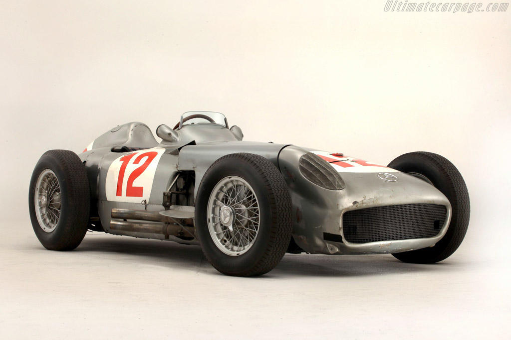
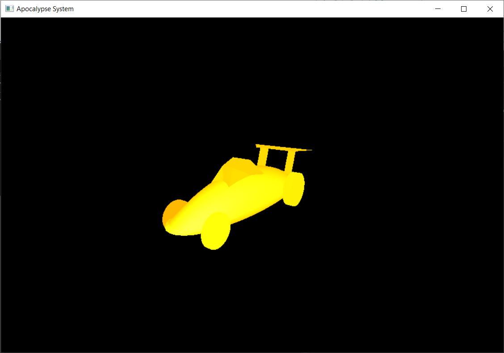
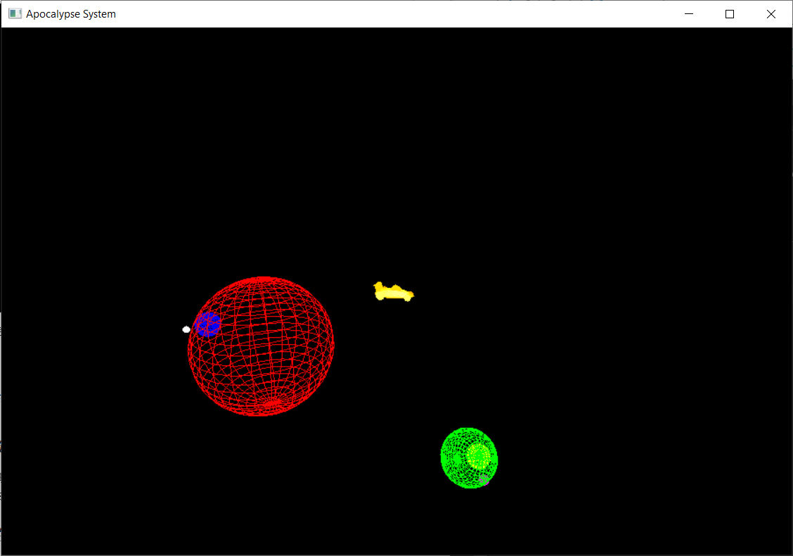

# A7

<div align='right'><font size=4><b>陈希尧</b> 3180103012</font>

[TOC]

## 功能说明

**控制**

* WSAD可以控制视角的前进后退左移右移
* '-'向下移动，'='向上移动（这里的上下是相对视角方向而不是相对坐标系）
* ↑↓←→方向键可以控制视角的上下左右旋转
* HJKL也可以控制视角的上下左右旋转（方向同vim）
* 鼠标点击后也可以拖移视角
* Q或ESC可以退出程序


**编译**

Windows下使用mingw-64的g++编译，glut库使用freeglut，跨平台时编译参数"-L"需修改为freeglut的lib所在位置

已在run.bat中配置完毕编译参数，双击即可编译&运行，同时压缩文件中包含静态链接的二进制文件，可直接执行

## 原理与实现方法

### 相机变换的原理

在上次的基础上，我添加了上下移动相机的功能，以实现完整的三轴控制：

```c
eyex -= flag * cos(polarAngle * D2R) * cos(azimuthAngle * D2R);
eyey -= flag * cos(polarAngle * D2R) * sin(azimuthAngle * D2R);
eyez += flag * cam_move_step * sin(polarAngle * D2R);
```

### 模型的构建

使用两种方法：NURBS和Subdivision，其中NURBS用于构建车身（分为上下两个部分），细分法用于构建扰流板、驾驶舱和轮胎。

### 光照的实现

设定光照参数与物体（车车）的材质参数，实现光照的效果，不然只能看到一个形状。

### CPP实现

由于汽车也可以算作一个星体，因此利用面向对象的继承特性在星体类的基础上实现汽车类，讲各个部件的绘制封装为函数`drawXxx()`，用继承自星体的`trans`控制汽车的公转自转（本次实验为了看清楚车车长什么样，关闭了公转）

## 实验结果

灵感来源：



汽车模型：



与太阳系合照：



## 总结

### 两种建模方法各自的优劣

* 曲面法
    * Pro
        * 需要的参数（控制点）更少
        * 获得的表明能更加的光滑（无限细度）
    * Con
        * 找到合适的控制点的过程较为麻烦
        * 无法实现所想即所得，得不断尝试去找到合适的控制点（或者借助CAD工具）
        * 渲染时，相同数量控制点绘制的曲面比细分法会占用更多的计算资源
* 细分法
    * Pro
        * 可以更好的实现自己想要建模的东西，只需要画出来即可，因此很直观
    * Con
        * 对于用细分法绘制的曲面，放大到最后肯定还是平面
        * 需要的参数（控制点）较多，设置起来麻烦，且更占用空间。

### 遇到的困难

1. NURBS的光照除了继续基础的设置，还要打开AUTO_NORMAL才能实现
2. 如果是本来只有单面光照的话，可以通过两种方法解决
    1. 对于NURBS曲面，可以调换控制点的顺序，让原本的内外平面交换而形状不变
    2. 如果一定要双面，需要同时修改LIGHT0和LIGHT1
    3. 注意：`glLightModeli(GL_LIGHT_MODEL_TWO_SIDE, GL_TRUE);`并不能起作用
3. 一开始用了面向对象的贴图方案，直接在构造函数里面初始化了贴图，然而一直不行，后来发现顺序不对，得gl init完了init才行，因此改了改贴图初始化的位置

### 心得

本次实验在编程上的难度主要在于光照的实现（虽然实验要求没有，但是强迫症看着只有形状没有表明的车子实在很难受），而车车本身的建模难度主要在于参数的选定，每次改参数都得编译一下看看结果，这麻烦的过程充分让我意识到了CAD工具在建模中的的重要性。

## Appendix

### Ref

[Lighting in OpenGL – HandsOn Sessions](http://www.csc.villanova.edu/~mdamian/Past/graphicssp13/notes/lightlab.pdf)

[Chapter 5 - OpenGL Programming Guide](https://www.glprogramming.com/red/chapter05.html)

[gluNurbsSurface](https://www.khronos.org/registry/OpenGL-Refpages/gl2.1/xhtml/gluNurbsSurface.xml)

### Src

#### SolarSys.h

```cpp
/**
 * @file SolarSys.h
 * @author Scott Chen
 * @em 3180103012@zju.edu.cn
 * @brief
 */
#ifndef SOLARSYS_H
#define SOLARSYS_H

#include <GL/gl.h>
#include <GL/glut.h>
#include <algorithm>
#include <cmath>
#include <iostream>
#include <tuple>
#include <vector>

const double PI  = 3.1425927;
const double D2R = PI / 180;

/* Global Parameter Def */
#define USING_WIRE  // Comment to use glutSolidSphere

const int spehereLineRatio   = 25;    // Control wire number of sphere
const int fluentRatio        = 2;     // The higher the value, the more fulent the animation
const double cam_move_step   = 0.25;  // Move step of camera using WSAD
const double cam_rotate_step = 1;     // Rotate step of camera using HJKL, in unit of degree
const double PRP_VRP_Dist    = 10;    // Distance from PRP to VRP
const double fovy            = 68;    // View volumn: angle of view
const double zNear           = 0.01;  // View volume: distance to near clipping plane
const double zFar            = 100;   // View volume: distance to far clipping plane

const GLfloat light_ambient[]  = {1, 0.5, 0, 0.5};
const GLfloat light_diffuse[]  = {0, 0.5, 1, 0.5};
const GLfloat light_specular[] = {0.5, 0, 0.5, 0.5};
const GLfloat mat_specular[]   = {0.6, 0.6, 0.6, 0.2}; /* white */
const GLfloat mat_diffuse[]    = {1., 0.5, 0.0, 0.6};  /* orange color */
const GLfloat mat_ambient[]    = {1.0, 0.6, 0.0, 0.4}; /* same as diffuse */
const GLfloat mat_shininess    = 5.0;

void gl_init(int argc, char **argv);
void display(void);
void reshape(int w, int h);
void keyboard(unsigned char key, GLint x, GLint y);
void keyboard_special(GLint key, GLint x, GLint y);
void mouseButton(int button, int state, int x, int y);
void mouseMove(int x, int y);
void idle();
void draw_cylinder(
    GLfloat radius, GLfloat height, GLubyte R = 255, GLubyte G = 255, GLubyte B = 255);

/**
 * @class an implenetation of camera with all its parameter and movement function
 */
class cameraObj {
  public:
    double eyex = 0, eyey = -PRP_VRP_Dist, eyez = 0;
    int mouse_oldx, mouse_oldy;

    double azimuthAngle      = 90,            // Counter-clock from x+
        polarAngle           = 90;            // Down from z+
    const double radicalDist = PRP_VRP_Dist;  // From origin

    void lookAt() {
        double ctx = eyex + radicalDist * sin(polarAngle * D2R) * cos(azimuthAngle * D2R),
               cty = eyey + radicalDist * sin(polarAngle * D2R) * sin(azimuthAngle * D2R),
               ctz = eyez + radicalDist * cos(polarAngle * D2R);
        double upx = -radicalDist * cos(polarAngle * D2R) * cos(azimuthAngle * D2R),
               upy = -radicalDist * cos(polarAngle * D2R) * sin(azimuthAngle * D2R),
               upz = radicalDist * sin(polarAngle * D2R);
        gluLookAt(eyex, eyey, eyez, ctx, cty, ctz, upx, upy, upz);
    }

    void reset() {
        glLoadIdentity();
        lookAt();
        glutPostRedisplay();
    }

    void moveForward(int flag = 1) {
        eyex += flag * cam_move_step * sin(polarAngle * D2R) * cos(azimuthAngle * D2R);
        eyey += flag * cam_move_step * sin(polarAngle * D2R) * sin(azimuthAngle * D2R);
        eyez += flag * cam_move_step * cos(polarAngle * D2R);
    }
    void moveLeft(int flag = 1) {
        eyex -= flag * cam_move_step * sin(azimuthAngle * D2R);
        eyey += flag * cam_move_step * cos(azimuthAngle * D2R);
    }
    void moveUp(int flag = 1) {
        eyex -= flag * cos(polarAngle * D2R) * cos(azimuthAngle * D2R);
        eyey -= flag * cos(polarAngle * D2R) * sin(azimuthAngle * D2R);
        eyez += flag * cam_move_step * sin(polarAngle * D2R);
    }
    void rotateLeft(double step = cam_rotate_step, int flag = 1) {
        azimuthAngle += flag * step;
    }
    void rotateUp(double step = cam_rotate_step, int flag = 1) { polarAngle -= flag * step; }

    void moveBackward() { moveForward(-1); }
    void moveRight() { moveLeft(-1); }
    void moveDown() { moveUp(-1); }
    void rotateRight(double step = cam_rotate_step) { rotateLeft(step, -1); }
    void rotateDown(double step = cam_rotate_step) { rotateUp(step, -1); }
};

/**
 * @class an implenetation of celestial object include sun, planet and satellite
 * and other smaller objects
 */
class celestialObj {
  private:
    // Const parameters
    float radius;
    float distance;  // distance from center
    float rotateV;
    float revolveV;
    float rotateTilt;
    float revolveTilt;
    std::tuple<int, int, int> colors;  // [0, 255]

    // State variables
    float rotateAngle  = 0;
    float revolveAngle = 0;

  public:
    // Functions
    celestialObj(float radius, float distance, float rotateV, float revolveV,
        float rotateTilt, float revolveTilt, int r, int g, int b)
        : radius(radius),
          distance(distance),
          rotateV(rotateV / fluentRatio),
          revolveV(revolveV / fluentRatio),
          rotateTilt(rotateTilt),
          revolveTilt(revolveTilt),
          colors(std::make_tuple(r, g, b)){};

    void trans(void) {
        using namespace std;
        glTranslatef(distance * cos(rotateTilt * D2R) * cos(rotateAngle * D2R),
            distance * cos(rotateTilt * D2R) * sin(rotateAngle * D2R),
            distance * sin(rotateTilt * D2R) * cos(rotateAngle * D2R));
        glRotatef(revolveAngle, -sin(revolveTilt * D2R), 0., cos(revolveTilt * D2R));
        glRotatef(revolveTilt, 0., -1., 0.);  // First rotate to tile angle
    }
    void draw() {
        using namespace std;
        trans();
        glColor3f(get<0>(colors) / 255., get<1>(colors) / 255., get<2>(colors) / 255.);
#ifdef USING_WIRE
        glutWireSphere(radius, spehereLineRatio, spehereLineRatio);
#else
        glutSolidSphere(radius, spehereLineRatio, spehereLineRatio);
#endif
    }

    void rotate() {
        rotateAngle += rotateV;
        rotateAngle = (rotateAngle > 360) ? rotateAngle - 360 : rotateAngle;
        revolveAngle += revolveV;
        revolveAngle = (revolveAngle > 360) ? revolveAngle - 360 : revolveAngle;
    }
};

/**
 * @class
 *
 */
class lighterObj {
  private:
    GLfloat pos[4] = {0, 0, 0, 1};

  public:
    // lighterObj() { this->init(); }

    void init(GLfloat x, GLfloat y, GLfloat z) {
        glClearColor(0.0, 0.0, 0.0, 0.0);
        pos[0] = x;
        pos[1] = y;
        pos[2] = z;

        glLightfv(GL_LIGHT0, GL_AMBIENT, light_ambient);
        glLightfv(GL_LIGHT0, GL_DIFFUSE, light_diffuse);
        glLightfv(GL_LIGHT0, GL_SPECULAR, light_specular);

        glLightfv(GL_LIGHT1, GL_AMBIENT, light_ambient);
        glLightfv(GL_LIGHT1, GL_DIFFUSE, light_diffuse);
        glLightfv(GL_LIGHT1, GL_SPECULAR, light_specular);

        glMaterialfv(GL_FRONT, GL_SPECULAR, mat_specular);
        glMaterialfv(GL_FRONT, GL_AMBIENT, mat_ambient);
        glMaterialfv(GL_FRONT, GL_DIFFUSE, mat_diffuse);
        glMaterialf(GL_FRONT, GL_SHININESS, mat_shininess);

        glLightfv(GL_LIGHT0, GL_POSITION, pos);
        glLightfv(GL_LIGHT1, GL_POSITION, pos);
    }

    static void enable(void) {
        glEnable(GL_LIGHTING);
        glEnable(GL_LIGHT0);
        glEnable(GL_LIGHT1);
        glEnable(GL_AUTO_NORMAL);
        glEnable(GL_NORMALIZE);
    }
    static void disable() {
        glDisable(GL_LIGHTING);
        glDisable(GL_LIGHT0);
        glDisable(GL_LIGHT1);
        glDisable(GL_AUTO_NORMAL);
        glDisable(GL_NORMALIZE);
    }
};

/**
 * @class
 *
 */
class carObj : public celestialObj {

  public:
    carObj() : celestialObj(0, 6, 0, 2, 0, 0, 0, 0, 0) {}
    ~carObj() {}

    void init(int surface_num) {
        theNurb_vec.resize(surface_num);
        for (auto &theNurb : theNurb_vec) {
            theNurb = gluNewNurbsRenderer();
            gluNurbsProperty(theNurb, GLU_SAMPLING_TOLERANCE, 25.0);
            gluNurbsProperty(theNurb, GLU_DISPLAY_MODE, GLU_FILL);
            gluNurbsCallback(theNurb, GLU_ERROR, (GLvoid(*)())(this->nurbsError));
        }
    }

    static void nurbsError(GLenum errorCode) {
        const GLubyte *estring;
        estring = gluErrorString(errorCode);
        fprintf(stderr, "Nurbs Error: %s\n", estring);
        exit(0);
    }

    void drawUp(void) {
        GLfloat ctl_pt[4][4][3] = {{{1, 3, 0}, {1, 3, 0}, {3, 3, 0}, {8, 2.5, 0}},
            {{0, 2, 0}, {1, 3, 2}, {7, 3, 3}, {9, 2, 0}},
            {{0, 1, 0}, {1, 0, 2}, {7, 0, 3}, {9, 1, 0}},
            {{1, 0, 0}, {1, 0, 0}, {3, 0, 0}, {8, 0.5, 0}}};
        GLfloat knots[8]        = {0.0, 0.0, 0.0, 0.0, 1.0, 1.0, 1.0, 1.0};
        gluBeginSurface(theNurb_vec[0]);
        gluNurbsSurface(theNurb_vec[0], 8, knots, 8, knots, 4 * 3, 3, &ctl_pt[0][0][0], 4, 4,
            GL_MAP2_VERTEX_3);
        gluEndSurface(theNurb_vec[0]);
    }

    void drawDown(void) {
        GLfloat ctl_pt[4][4][3] = {{{1, 0, 0}, {1, 0, 0}, {3, 0, 0}, {8, 0.5, 0}},
            {{0, 1, 0}, {1, 0, -1}, {7, 0, -1.6}, {9, 1, 0}},
            {{0, 2, 0}, {1, 3, -1}, {7, 3, -1.6}, {9, 2, 0}},
            {{1, 3, 0}, {1, 3, 0}, {3, 3, 0}, {8, 2.5, 0}}};
        GLfloat knots[8]        = {0.0, 0.0, 0.0, 0.0, 1.0, 1.0, 1.0, 1.0};
        gluBeginSurface(theNurb_vec[1]);

        gluNurbsSurface(theNurb_vec[1], 8, knots, 8, knots, 4 * 3, 3, &ctl_pt[0][0][0], 4, 4,
            GL_MAP2_VERTEX_3);
        gluEndSurface(theNurb_vec[1]);
    }

    void drawTires(void) {
        // LF
        glPushMatrix();
        glTranslatef(7.5, 0.4, -0.1);
        glRotatef(90, 1, 0, 0);
        draw_cylinder(0.7, 0.2);
        glPopMatrix();

        // RF
        glPushMatrix();
        glTranslatef(7.5, 2.6, -0.1);
        glRotatef(90, -1, 0, 0);
        draw_cylinder(0.7, 0.2);
        glPopMatrix();

        // LB
        glPushMatrix();
        glTranslatef(2, -0.1, 0.1);
        glRotatef(90, 1, 0, 0);
        draw_cylinder(0.9, 0.4);
        glPopMatrix();

        // RB
        glPushMatrix();
        glTranslatef(2, 3.1, 0.1);
        glRotatef(90, -1, 0, 0);
        draw_cylinder(0.9, 0.4);
        glPopMatrix();
    }

    void drawSpoiler(void) {
        const GLfloat fan_y[] = {0.6, 2.4};
        for (int i = 0; i < 2; i++) {
            glBegin(GL_POLYGON);
            glVertex3f(2, fan_y[i], 0.5);
            glVertex3f(1, fan_y[i], 0.5);
            glVertex3f(0.5, fan_y[i], 2);
            glVertex3f(1.5, fan_y[i], 2);
            glEnd();
        }

        glBegin(GL_POLYGON);
        glVertex3f(0.5, fan_y[0] - 1, 2);
        glVertex3f(0.5, fan_y[1] + 1, 2);
        glVertex3f(1.5, fan_y[1] + 0.3, 2);
        glVertex3f(1.5, fan_y[0] - 0.3, 2);
        glEnd();
    }

    void drawCockpit(void) {
        const GLfloat pt[8][3] = {{3, 0.5, 0.5}, {6.5, 0.8, 0.5}, {6.5, 2.2, 0.5},
            {3, 2.5, 0.5}, {4.5, 1, 2.}, {5.5, 1.2, 1.8}, {5.5, 1.8, 1.8}, {4.5, 2, 2.}};
        glBegin(GL_TRIANGLE_STRIP);
        glVertex3f(pt[0][0], pt[0][1], pt[0][2]);
        glVertex3f(pt[4][0], pt[4][1], pt[4][2]);
        glVertex3f(pt[1][0], pt[1][1], pt[1][2]);
        glVertex3f(pt[5][0], pt[5][1], pt[5][2]);
        glVertex3f(pt[2][0], pt[2][1], pt[2][2]);
        glVertex3f(pt[6][0], pt[6][1], pt[6][2]);
        glVertex3f(pt[3][0], pt[3][1], pt[3][2]);
        glVertex3f(pt[7][0], pt[7][1], pt[7][2]);
        glVertex3f(pt[0][0], pt[0][1], pt[0][2]);
        glVertex3f(pt[4][0], pt[4][1], pt[4][2]);
        glEnd();
        glBegin(GL_POLYGON);

        glVertex3f(pt[4][0], pt[4][1], pt[4][2]);
        glVertex3f(pt[5][0], pt[5][1], pt[5][2]);
        glVertex3f(pt[6][0], pt[6][1], pt[6][2]);
        glVertex3f(pt[7][0], pt[7][1], pt[7][2]);
        glEnd();
    }

  private:
    bool showPoints = 1;

    std::vector<GLUnurbsObj *> theNurb_vec;
};

#endif
```

#### SolarSys.cpp

```cpp
/**
 * @file SolarSys.cpp
 * @author Scott Chen
 * @em 3180103012@zju.edu.cn
 * @brief This is an implementation to A4 of CG by prof. Hongzhi Wu
 *
 * @ref glMatrix(): https://community.khronos.org/t/glpushmatrix-glpopmatrix/20189/2
 * @ref glRotatef(): axis from the origin through the point (x, y, z).
 * @ref gluLookAt():
 *      https://www.khronos.org/registry/OpenGL-Refpages/gl2.1/xhtml/gluLookAt.xml
 * @ref spherical coordinate:
 *      https://zh.wikipedia.org/wiki/%E7%90%83%E5%BA%A7%E6%A8%99%E7%B3%BB
 * @ref object hidding: https://blog.csdn.net/Wadejr/article/details/7489928
 * @ref lighting: http://www.csc.villanova.edu/~mdamian/Past/graphicssp13/notes/lightlab.pdf
 * @ref lighting: https://www.glprogramming.com/red/chapter05.html
 * @ref gluNurbsSurface:
 * https://www.khronos.org/registry/OpenGL-Refpages/gl2.1/xhtml/gluNurbsSurface.xml
 */
#include "SolarSys.h"

cameraObj camera;
std::vector<celestialObj> starVec;

lighterObj lighter1, lighter2;
carObj car;

int main(int argc, char *argv[]) {
    // radius, distance, rotateV, revolveV, rotateTilt, revolveTilt, r, g, b
    starVec.emplace_back(2, 0, 0, 0.5, 0., 0., 255, 0, 0);        // sun
    starVec.emplace_back(0.4, 3, -3, -2, 10., 23.5, 0, 0, 255);   // earth
    starVec.emplace_back(0.1, 0.8, 9, 3, 0, 0., 255, 255, 255);   // moon
    starVec.emplace_back(1.1, 10, 1, 2, -45., 60., 0, 255, 0);    // jupiter
    starVec.emplace_back(0.5, 1.9, 5, 3, 80., 10., 255, 255, 0);  // europa
    starVec.emplace_back(0.2, 1, 10, 3, 20., 90., 255, 0, 255);   // something

    car.init(2);

    gl_init(argc, argv);
    lighter1.init(0, 0, 1);  // Must be placed after Shade model set

    glHint(GL_PERSPECTIVE_CORRECTION_HINT, GL_NICEST);

    glutDisplayFunc(display);
    glutReshapeFunc(reshape);
    glutKeyboardFunc(keyboard);
    glutSpecialFunc(keyboard_special);
    glutMouseFunc(mouseButton);
    glutMotionFunc(mouseMove);
    glutIdleFunc(idle);

    glutMainLoop();
    return 0;
}

void gl_init(int argc, char **argv) {
    glutInit(&argc, argv);
    glutInitDisplayMode(GLUT_DOUBLE | GLUT_RGB | GLUT_DEPTH);
    glutInitWindowSize(900, 600);
    glutCreateWindow("Apocalypse System");
    glClearColor(0., 0., 0., 0.);
    glShadeModel(GL_FLAT);

    glEnable(GL_DEPTH_TEST);
    glDepthFunc(GL_LESS);
}

void display() {
    glClear(GL_COLOR_BUFFER_BIT | GL_DEPTH_BUFFER_BIT);

    glPushMatrix();
    starVec[0].draw();
    glPopMatrix();

    glPushMatrix();
    starVec[1].draw();
    starVec[2].draw();
    glPopMatrix();

    glPushMatrix();
    starVec[3].draw();
    starVec[4].draw();
    starVec[5].draw();
    glPopMatrix();

    glPushMatrix();
    lighter1.enable();

    car.trans();
    glScalef(0.5, 0.5, 0.5);
    glTranslatef(-4.5, -1.5, 0);

    car.drawUp();
    car.drawDown();
    car.drawTires();
    car.drawSpoiler();
    car.drawCockpit();

    lighter1.disable();
    glPopMatrix();

    glFlush();

    glutSwapBuffers();
}

void reshape(int w, int h) {
    glViewport(0, 0, w, h);
    glMatrixMode(GL_PROJECTION);
    glLoadIdentity();

    gluPerspective(fovy, (double)w / (double)h, zNear, zFar);
    glMatrixMode(GL_MODELVIEW);
    glLoadIdentity();
    camera.lookAt();
}

void keyboard(unsigned char key, GLint x, GLint y) {
    bool changed = 1;
    switch (key) {
        case 'w': camera.moveForward(); break;
        case 's': camera.moveBackward(); break;
        case 'a': camera.moveLeft(); break;
        case 'd': camera.moveRight(); break;

        case 'h': camera.rotateLeft(); break;
        case 'j': camera.rotateDown(); break;
        case 'k': camera.rotateUp(); break;
        case 'l': camera.rotateRight(); break;

        case '=': camera.moveUp(); break;
        case '-': camera.moveDown(); break;

        case 'q': exit(0); break;
        case 27: exit(0); break;

        default: changed = 0; break;
    }
    if (changed)
        camera.reset();
}

void keyboard_special(GLint key, GLint x, GLint y) {
    bool changed = 1;
    switch (key) {
        case GLUT_KEY_UP: camera.rotateUp(); break;
        case GLUT_KEY_DOWN: camera.rotateDown(); break;
        case GLUT_KEY_LEFT: camera.rotateLeft(); break;
        case GLUT_KEY_RIGHT: camera.rotateRight(); break;
        default: changed = 0; break;
    }
    if (changed)
        camera.reset();
}

void mouseButton(int button, int state, int x, int y) {
    if (button == GLUT_LEFT_BUTTON && state == GLUT_DOWN) {
        camera.mouse_oldx = x;
        camera.mouse_oldy = y;
    }
}

void mouseMove(int x, int y) {
    camera.rotateLeft((x - camera.mouse_oldx) / 5);
    camera.rotateUp((y - camera.mouse_oldy) / 5);
    camera.mouse_oldx = x;
    camera.mouse_oldy = y;
    camera.reset();
}

void idle() {
    for (auto &i : starVec)
        i.rotate();
    car.rotate();
    glutPostRedisplay();
    Sleep(30 / fluentRatio);
}

void draw_cylinder(GLfloat radius, GLfloat height, GLubyte R, GLubyte G, GLubyte B) {
    GLfloat x                    = 0.0;
    GLfloat y                    = 0.0;
    const GLfloat angle_stepsize = 0.1;

    /** Draw the tube */
    glColor3ub(R, G, B);
    glBegin(GL_QUAD_STRIP);
    for (GLfloat angle = 0.0; angle <= 2 * PI + angle_stepsize; angle += angle_stepsize) {
        x = radius * cos(angle);
        y = radius * sin(angle);
        glVertex3f(x, y, 0.5 * height);
        glVertex3f(x, y, -0.5 * height);
    }
    glEnd();

    /** Draw the circle on top of cylinder */
    glColor3ub(R, G, B);
    glBegin(GL_POLYGON);
    for (GLfloat angle = 0.0; angle <= 2 * PI; angle += angle_stepsize) {
        x = radius * cos(angle);
        y = radius * sin(angle);
        glVertex3f(x, y, 0.5 * height);
    }
    glEnd();

    /** Draw the circle on bottom of cylinder */
    glColor3ub(R, G, B);
    glBegin(GL_POLYGON);
    for (GLfloat angle = 2 * PI; angle >= 0; angle -= angle_stepsize) {
        x = radius * cos(angle);
        y = radius * sin(angle);
        glVertex3f(x, y, -0.5 * height);
    }
    glEnd();
}
```

